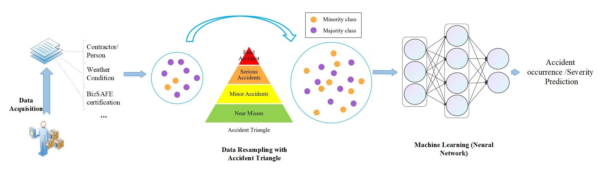
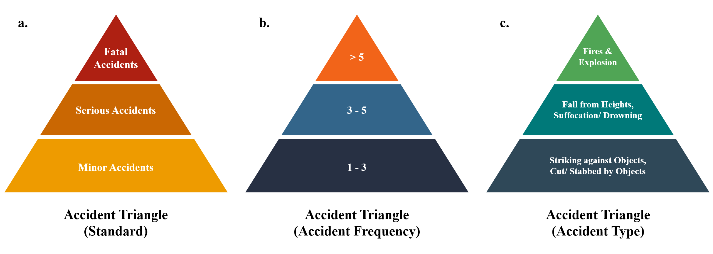
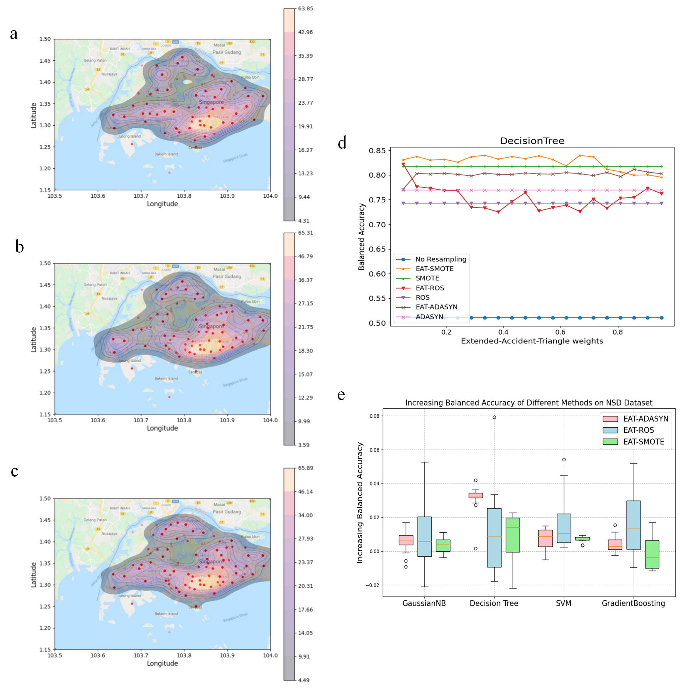

# Accident_triangle

Code for article:  Overcoming Imbalanced Safety Data Using Extended Accident Triangle


 
 
 

 

## Environment
The code is tested on Windows 10.

- imblearn
- sklearn
- torch
- pandas


## Usage


```bash 
python plot-xiang.py
```

```bash 
python over.py
```

## Acknowledgements

SCD was collected while one of the authors worked at Liberty Mutual Research Institute for Safety. We thank the following team members for their invaluable assistance: Michelle Robertson, Susan Jeffries, Peg Rothwell, and Angela Garabet for data collection, analysis, and general assistance. We thank the Singapore Ministry of Manpower for supplying NSD and approving it for sharing. Finally, we would like to acknowledge the support from the anonymous construction organization which supplied SMD and approved it for sharing.


## Contact Us

If you have other questions❓, please contact us in time 👬

